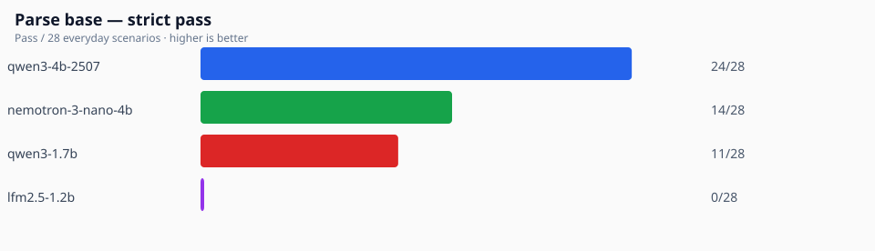
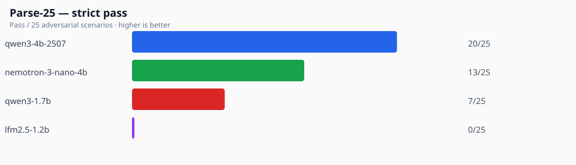
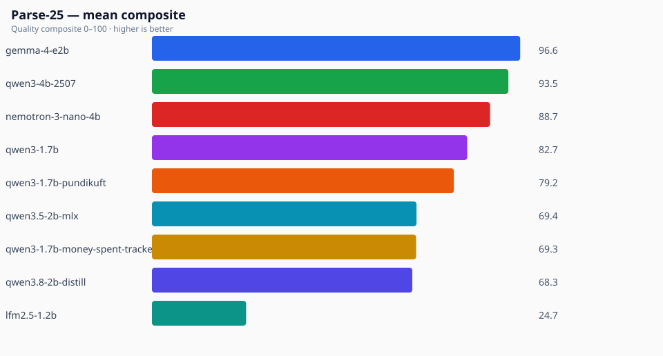
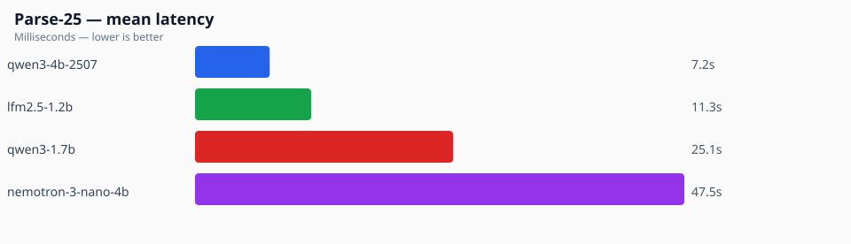

# Parse charts

Generated: 2026-08-23T11:06:33.953Z

Local OpenAI-compatible runs only. Board: `docs/results/parse/parse-leaderboard-latest.md`.

#### Base strict pass

  

#### Hard-25 strict pass

  

#### Hard-25 mean composite

  

#### Hard-25 mean latency

  

## Table

| Model | Base | Hard strict | Hard composite | Hard latency |
|-------|-----:|------------:|---------------:|-------------:|
| `qwen3-4b-2507` | 24/28 | 20/25 | 93.5 | 7.2s |
| `gemma-4-e2b` | 26/28 | 19/25 | 96.6 | 12.0s |
| `nemotron-3-nano-4b` | 14/28 | 13/25 | 88.7 | 47.5s |
| `qwen3-1.7b-pundikuft` | 14/28 | 12/25 | 79.2 | 1.5s |
| `qwen3.5-2b-mlx` | 16/28 | 10/25 | 69.4 | 5.8s |
| `qwen3.8-2b-distill` | 13/28 | 8/25 | 68.3 | 13.3s |
| `qwen3-1.7b` | 11/28 | 7/25 | 82.7 | 25.1s |
| `qwen3-1.7b-money-spent-tracker` | 13/28 | 7/25 | 69.3 | 1.5s |
| `lfm2.5-1.2b` | 0/28 | 0/25 | 24.7 | 11.3s |
